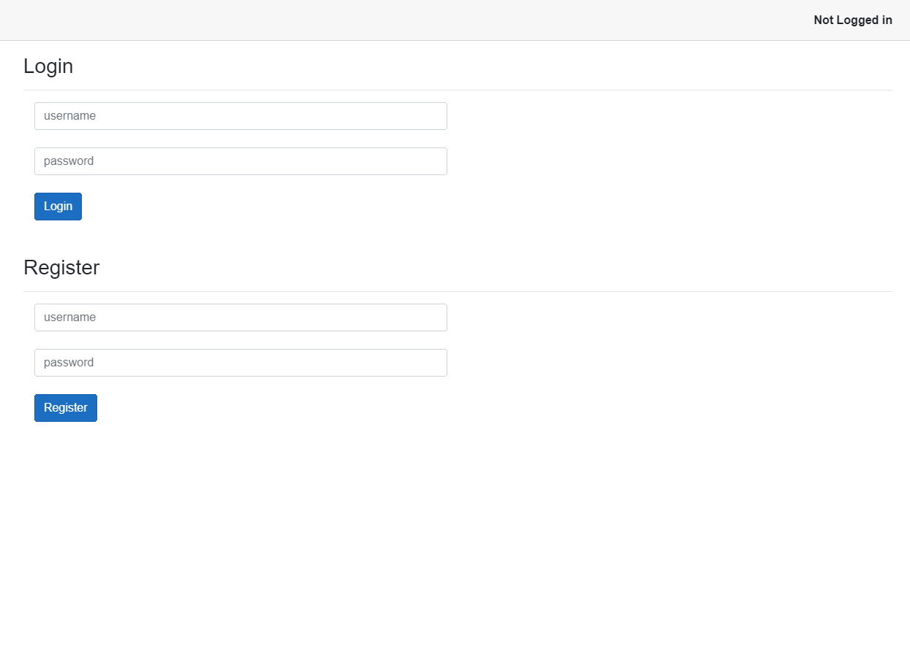
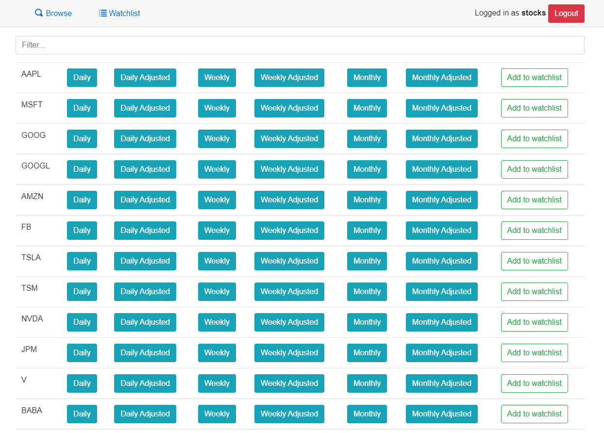
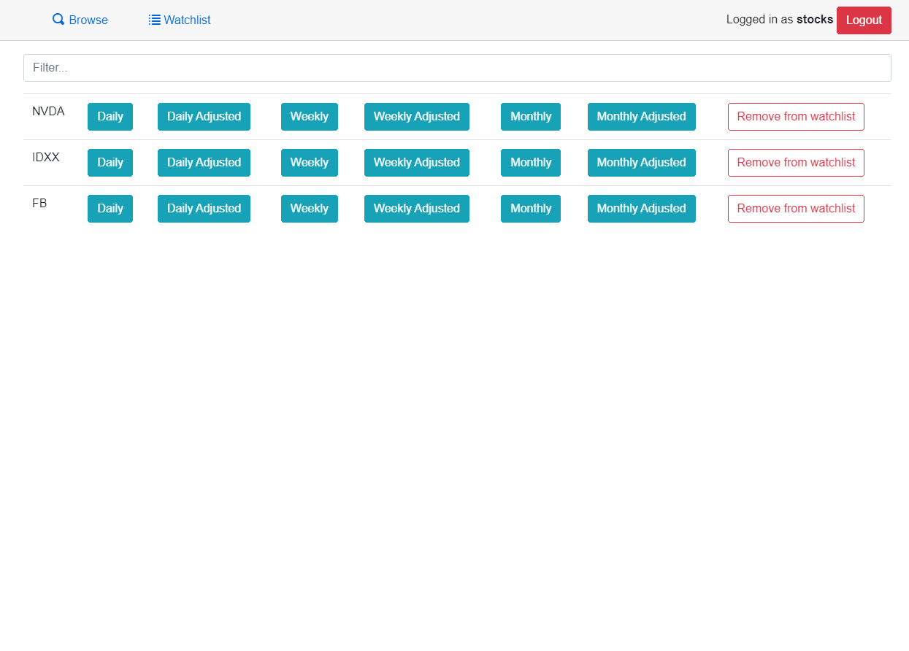
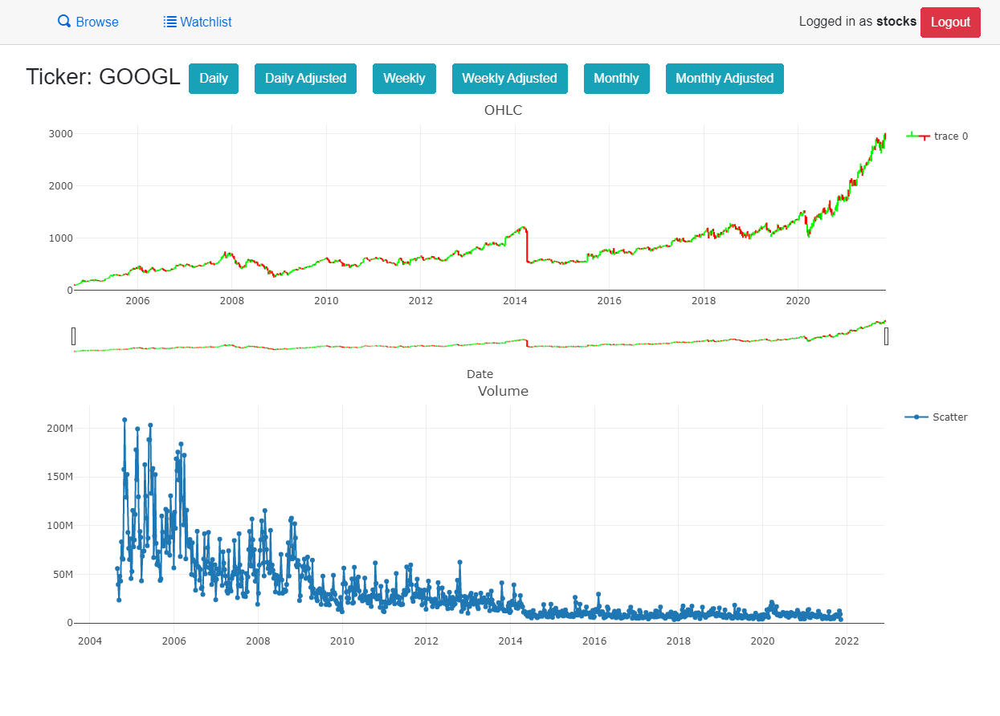

# Stocks
<p align="left">
  <a href="https://github.com/adamjedrzejewski/stocks/actions/workflows/adajstocks.yml">
    
  </a>
  <a href="https://github.com/adamjedrzejewski/stocks/blob/main/LICENSE">
    
  </a>
</p>

<!-- About -->
## About the project
### Description
Simple web service that let's you browse tickers and their movement in price.
### Usage
<details>
  <summary>Login and Register</summary>
  Create an account, login in to your account.
  
</details>

<details>
  <summary>Browse Tickers</summary>
  Browse a list of tickers, add tickers to your watchlist.
  
</details>

<details>
  <summary>User Watchlist</summary>
  Browse your ticker watchlist, remove from watchlist.
  
</details>

<details>
  <summary>Ticker Page</summary>
  See ticker OHLC and Volume.
  
</details>

## Getting started
### Prerequisites
You will need [.NET 5](https://dotnet.microsoft.com/download/dotnet/5.0) and running instance of [SQL Server](https://www.microsoft.com/en-us/sql-server/sql-server-downloads).
### Installation
1. Clone the repository
```
git clone https://github.com/adamjedrzejewski/stocks.git
```
2. Restore dependencies
```
dotnet restore
```
3. Build
```
dotnet build --configuration Release
```

### Configuration
Put configuration options in _Server/appsettings.json_, consider using secrets if for other purposes than testing.<br>
You will need:
1. SQL Server connection string
```json
"ConnectionStrings": {
  "default": "{your connection string}"
}
```

2. Alpha Vantage API key. Get one [_here_](https://www.alphavantage.co/support/#api-key).
```json
"AlphaVantageServiceApiKey": "{your api key}"
```

### Running
```
dotnet run --configuration Release # inside Server directory
```

<!-- Built with -->
## Built with
* [ASP.NET Core](https://github.com/dotnet/aspnetcore)
* [Entity Framework Core](https://github.com/dotnet/efcore)
* [SQL Server](https://www.microsoft.com/en-us/sql-server/sql-server-2019)
* [Blazor](https://dotnet.microsoft.com/apps/aspnet/web-apps/blazor)
* [Alpha Vantage Stock API](https://www.alphavantage.co/)

<!-- LICENSE -->
## License
Distributed under the BSD-3-Clause License. See `LICENSE` for more information.
